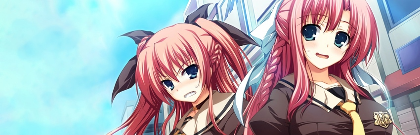
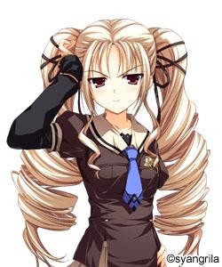

# **Akatsuki no Goei**

## **Route Guideline**

> [!NOTE]
> The majority of these choices do not affect which heroine's route you end up on, and are merely focused on collecting extra CGs.

### **Kokudou Kyouka**

* **[Choose any]**
* **[Choose any]**
* Kyouka
* Go

### **Reika bonus scene**

* Reika
* Don't go
* **[Choose any]**
* **[Choose any]**
> **After Route clear:**
> In main menu go to Extra, Scene Replay, Extra, select "a plan to get closer to Reika"
> keep rejecting Takanori until a sound plays and a popup says you have unlocked a new scene
> Takanori bonus scene is found in main menu under `Extra, Scene Replay, Extra`

### **Kurayashiki Tae**

* Ok, I'll Stop now
* Don't do it
#### **Bonus Akiko H-scene: Optional**

   * First floor
   * Second floor
   * Other choices -> Aya's room
   * Other choices -> Reika's room (X2)
   * I'll go and give her the samples -> **Akiko H-scene**
   * I won't carry them today -> **Skip H-scene**
> To simplify the steps in case you aren't interested in the bonus H-scene, just choose differently from above

### **Anzu**

* I have to risk it and go outside
* I can't give up on it now!
* Slowly approach her
* It's better to do nothing here

