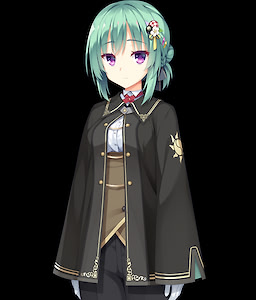

# **Angelic☆Chaos RE-BOOT!**

## **ROUTE GUIDELINE**

### **Shirayuki Noa**

* **[SAVE 1]**
* I have to resist...
* **[SAVE 2]**
* Start with Noa.
* Enough is enough.
* I can't...unless?
* No need to bother.
* Do it myself.
* I'm good for now.
* Noa.
* **[SAVE 3]**
* I want to.
#### **Noa Bad End**
* **[LOAD 3]**
* I want to, but...

### **Tanikaze Amane**

* **[LOAD 2]**
* Take a break.
* Inquire further.
* I can't show her.
* Extend an invite.
* **[SAVE 4]**
* Do it myself.
* **[SAVE 5]**
* I'm good for now.
* **[SAVE 6]**
* Amane?
* Ask about something bothering me.
* Go with her.

### **Kohibari Kurumi**

* **[LOAD 6]**
* Kohibari-san
* Tell her she looks good.
* Stay and watch over everyone's belongings.

### **Hoshikawa Kaguya**

* **[LOAD 4]**
* Ask her.
* I'm good for now.
* Kaguya.
* Ask about something bothering me.
* Go with her.

### **Takadate Orie**

* **[LOAD 6]**
* Orie.
* Tell her she looks good.
* Look by myself.
* **[SAVE 7]**

### **Ozato Fumika**

* **[LOAD 5]**
* I have some questions.
* Noa.
* Tell her she looks good.
* Go with her.

### **Mikuni Sairi (Bad End)**

* **[LOAD 1]**
* I can't resist!

### **Scene Collection**
* **[LOAD 2]**
* Start with Schtoria.

### **Normal End**
* **[LOAD 7]**
* Don't say it.
