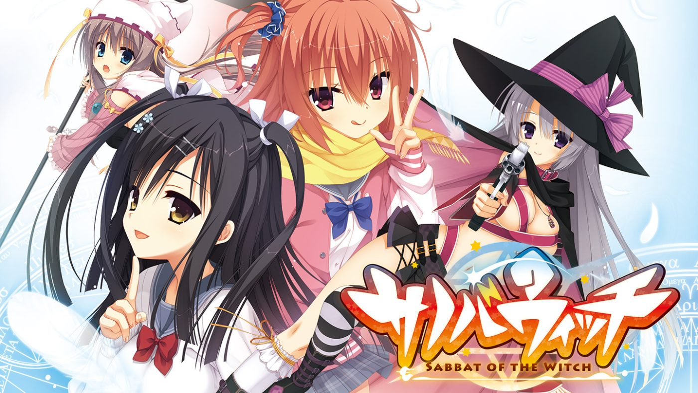

# **Sabbat of the Witch**

## **Route Guideline**

### **Ayachi Nene**

* Sincerely compliment her again
* **[SAVE 1]**
* Ask Ayachi-san to do it
* See the movie later
* **[SAVE 2]**
* Get going
* Maybe, yeah
* Answer her honestly
* Tell her the truth
* Put Classical Japanese aside for now
* Ask her to do it one more time
* Look away
* **[SAVE 3]**
* Probably Ayachi-san

### **Ayachi Nene 2nd Route**
* Select **RESTART** from title screen

### **Inaba Meguru**

* **[LOAD 1]**
* Keep working with Inaba-san
* … This is difficult
* … This is part of the rehearsal
* Not really
* Answer her normally
* Gloss over it
* Have Togakushi-senpai tutor me
* … I can't say it
* Compliment her
* **[SAVE 4]**
* Inaba-san, I guess

### **Shiiba Tsumugi**

* **[LOAD 3]**
* The band is more important

### **Togakushi Touko**

* **[LOAD 4]**
* Hmm… Togakushi-senpai?

### **Kariya Wakana**

* **[LOAD 2]**
* Eat something first
* Maybe, yeah
* Play around a little
* Gloss over it
* Have Togakushi-senpai tutor me

### **Normal Ending**
* **[LOAD 4]**
* The band is more important

